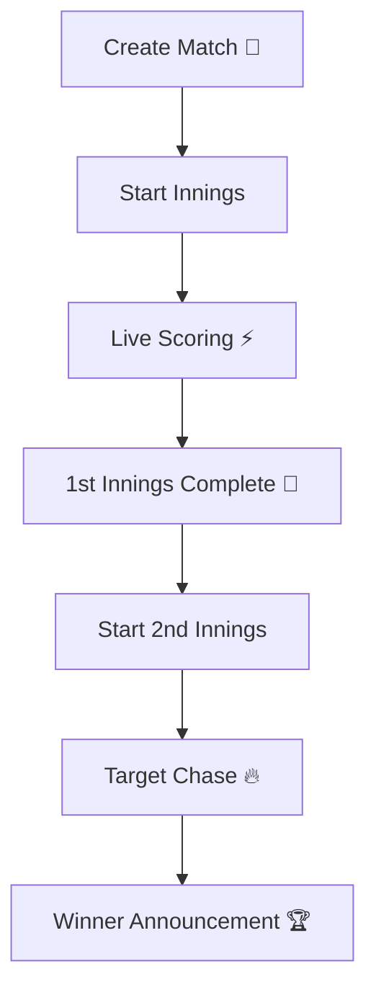

# 🏏 GullyCrickers

<div align="center">


### ⚡ Real-Time Cricket Scoring Platform ⚡

**Create matches. Score live. Watch updates instantly across devices.**

</div>

---

# 🚀 Features

## ✅ Authentication

* User Signup & Login
* JWT Authentication
* Protected Match Creation

---

## ✅ Match Management

* Create Match
* Load Existing Match
* Dynamic Match Routing

```bash id="tbpn2w"
/match/:id
```

---

## ✅ Real-Time Live Scoring

* Ball-by-ball scoring
* Live score updates using Socket.IO
* Multi-window synchronization
* Real-time innings updates

---

## ✅ Cricket Logic

* Strike Rotation
* Over Management
* Wicket Handling
* Extras:

  * Wide
  * No Ball
* Dynamic Target Calculation
* First & Second Innings Flow
* Match Winner Detection

---

## ✅ Live Match UI

* Live Scoreboard
* Striker / Non-Striker Display
* Bowler Display
* Batsman Runs & Balls
* Overs & Wickets Tracking
* Match Status Updates

---

# 🛠️ Tech Stack

<div align="center">

| Frontend        | Backend       | Database    | Real-Time     |
| --------------- | ------------- | ----------- | ------------- |
| React.js ⚛️     | Node.js 🟢    | MongoDB 🍃  | Socket.IO ⚡   |
| Tailwind CSS 🎨 | Express.js 🚂 | Mongoose 📦 | WebSockets 🌐 |
| Framer Motion ✨ | JWT Auth 🔐   |             |               |

</div>

---

# 📂 Project Structure

```bash id="2rw7vb"
GullyCrickers/
│
├── Backend/
│   ├── Controllers/
│   ├── Models/
│   ├── Routes/
│   ├── Middleware/
│   ├── socket.js
│   └── server.js
│
├── Frontend/
│   ├── src/
│   │   ├── Components/
│   │   ├── Pages/
│   │   ├── App.jsx
│   │   └── main.jsx
│
└── README.md
```

---

# ⚡ Installation

## 1️⃣ Clone Repository

```bash id="d5xx2x"
git clone https://github.com/YOUR_USERNAME/GullyCrickers.git
```

---

## 2️⃣ Install Backend Dependencies

```bash id="yoz7kz"
cd Backend
npm install
```

---

## 3️⃣ Install Frontend Dependencies

```bash id="twj3h6"
cd Frontend
npm install
```

---

# 🔑 Environment Variables

Create a `.env` file inside `Backend/`

```env id="0d0qyn"
PORT=5000
MONGO_URI=your_mongodb_connection
JWT_SECRET=your_secret_key
```

---

# ▶️ Run Project

## Start Backend

```bash id="pwkg1z"
cd Backend
npm run dev
```

---

## Start Frontend

```bash id="o3a9eq"
cd Frontend
npm run dev
```

---

# 🌐 Application Flow



---

# 📸 Future Features

* Toss System
* Public Spectator Mode
* Host-only Scoring Controls
* Commentary Feed
* Required Run Rate
* Partnership Stats
* Match History
* Scorecard Export
* Player Profiles
* Deployment

Because every side project eventually evolves into:

> “Maybe I should just build the entire IPL infrastructure myself.” 🏏💀

---

# 🧠 What I Learned

* Real-time communication with Socket.IO
* Stateful frontend architecture
* REST API design
* Match state management
* Cricket scoring logic
* Authentication & Authorization
* MongoDB schema design
* React routing & live updates

---

# ⭐ Show Some Support

If you like this project, give it a ⭐ on GitHub.

It helps developers continue debugging websocket cricket logic instead of peacefully touching grass.

<div align="center">

### 🏆 Built with caffeine, confusion, and cricket obsession 🏆

</div>
